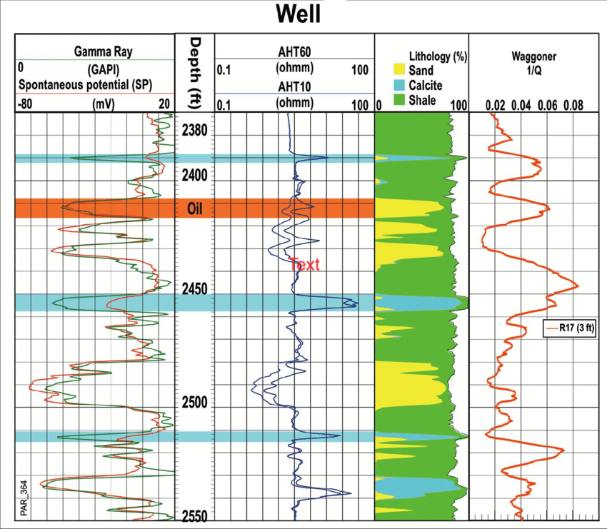
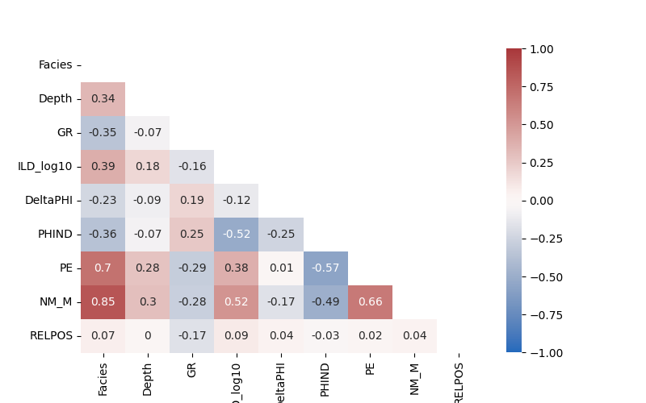
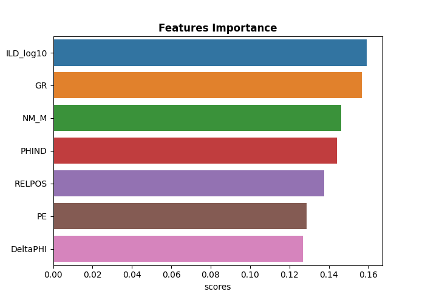
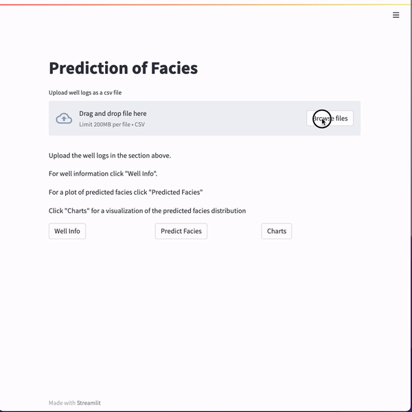
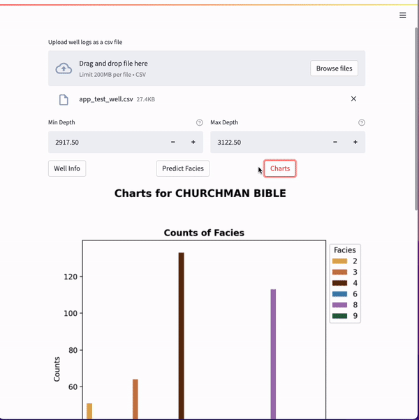

  <h2 align="center" style="margin-top: 0px;">FACIES CLASSIFICATION</h2>

## Key Takeaway
- Well logs are used to predict and classifiy the facies (rock-types) of the formations in the segment (zones) of the well captured in the logs.
- The web app shows the well logs and the predicted facies in a plot that can be read by end users
## Author
- [ChigozieObika](https://www.github.com/ChigozieObika)

## Table of Contents

  - [Business problem](#business-problem)
  - [Summary of Solution](#summary-of-solution)
  - [Data source](#data-source)
  - [Steps to Solution](#steps-to-solution)
  - [Tech Stack](#tech-stack)
  - [Summary of Results](#summary-of-results)
  - [Limitation and Recommendations](#limitation-and-recommendations)
  - [Contribution](#contribution)
  - [License](#license)

## Business problem
Well logs are used to determine the facies (rock-types) in a well or a sectionn of it. There is no consistency in the interpretations of these logs as different geologists will apply different criteria to arrive at the rock types. This is in addition to the man hours it takes geologists to do these interpretations.

## Summary of Solution
A multi-class classifier is trained with well logs data. The classifier predicts the facies (rock type) at a given depth in well using log information as inputs. Each facies is mapped to a colour. Using these colours, the predicted facies are plotted in a visualisation of the classifier predictions together with the log plots of the well. The plot is referenced by depth which aids in its readability by an end user. 

## Data Source
[Well Log Facies](https://www.kaggle.com/datasets/imeintanis/well-log-facies-dataset)

## Tech Stack
- Python (refer to requirement.txt for the packages used in this project)
- Scikit Learn (model training)
- Power BI (Dashboard)
- Flask (model deployment)
- Heroku (web service)

## Summary of Results

### Correlation between the features.

### Confusion matrix of LogisticRegression Classifier

### Features Importance.

### Deployed App
#### Display well information

#### Disply plots of predicted facies and their sizes by count 

#### Display message indicating selected depth is out of range 

## Limitation and Recommendations

- There are adjacent facies in the dataset that are easily misclassified.
- The input features for the model do not measure rock types qualities, they measure qualities of hydrocarbons in the rocks.
- Use features that directly measures characteristics of rocks
- Use a bigger dataset to train the model. 
- Redefine the classes in the dataset to pair together facies that have similar characteristics
- Incorporate dashboard into deployed model

## Contribution

Pull requests are welcome! For major changes, please open an issue first to discuss what you would like to change or contribute.

## License

MIT License

Copyright (c) 2022 Chigozie Obika

Permission is hereby granted, free of charge, to any person obtaining a copy
of this software and associated documentation files (the "Software"), to deal
in the Software without restriction, including without limitation the rights
to use, copy, modify, merge, publish, distribute, sublicense, and/or sell
copies of the Software, and to permit persons to whom the Software is
furnished to do so, subject to the following conditions:

The above copyright notice and this permission notice shall be included in all
copies or substantial portions of the Software.

THE SOFTWARE IS PROVIDED "AS IS", WITHOUT WARRANTY OF ANY KIND, EXPRESS OR
IMPLIED, INCLUDING BUT NOT LIMITED TO THE WARRANTIES OF MERCHANTABILITY,
FITNESS FOR A PARTICULAR PURPOSE AND NONINFRINGEMENT. IN NO EVENT SHALL THE
AUTHORS OR COPYRIGHT HOLDERS BE LIABLE FOR ANY CLAIM, DAMAGES OR OTHER
LIABILITY, WHETHER IN AN ACTION OF CONTRACT, TORT OR OTHERWISE, ARISING FROM,
OUT OF OR IN CONNECTION WITH THE SOFTWARE OR THE USE OR OTHER DEALINGS IN THE
SOFTWARE.

Learn more about [MIT](https://choosealicense.com/licenses/mit/) license
